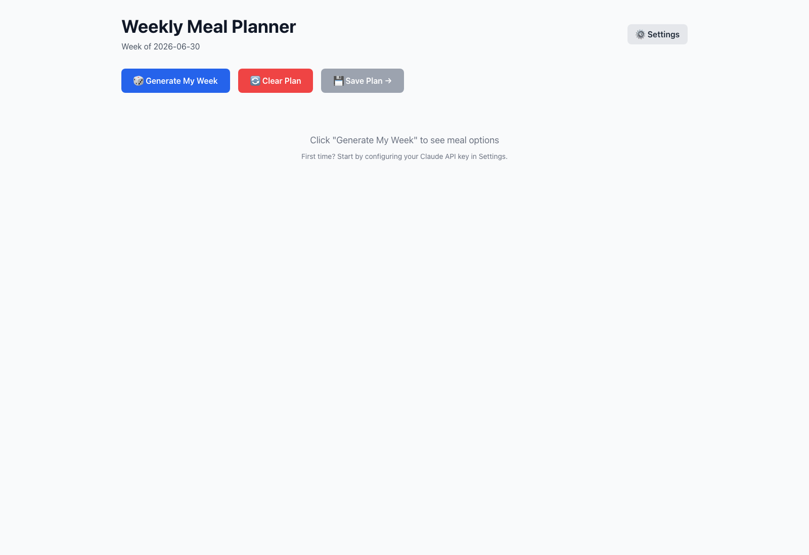
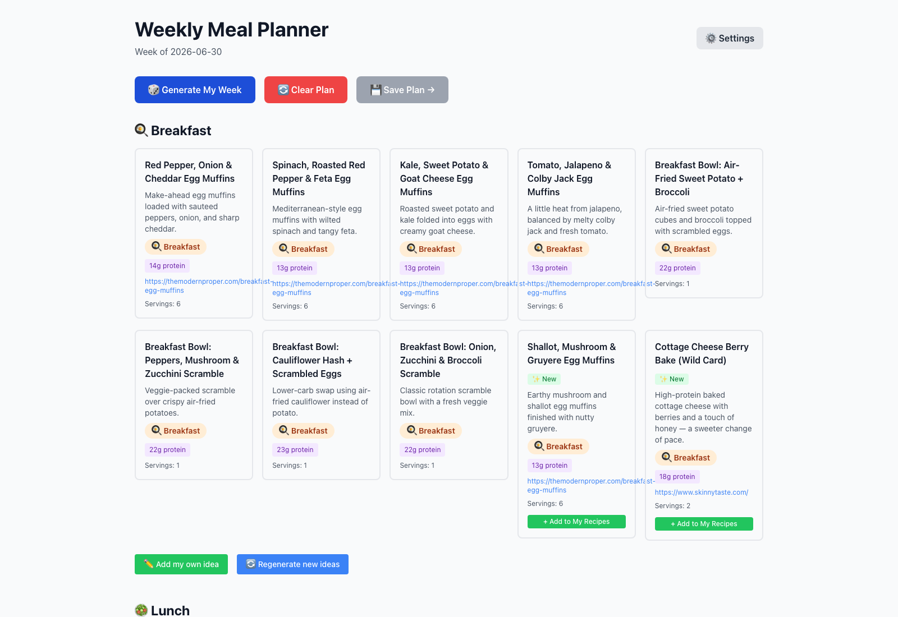
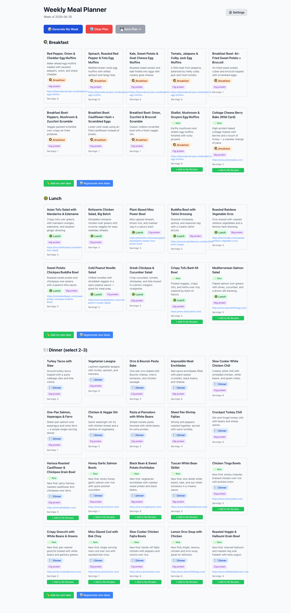
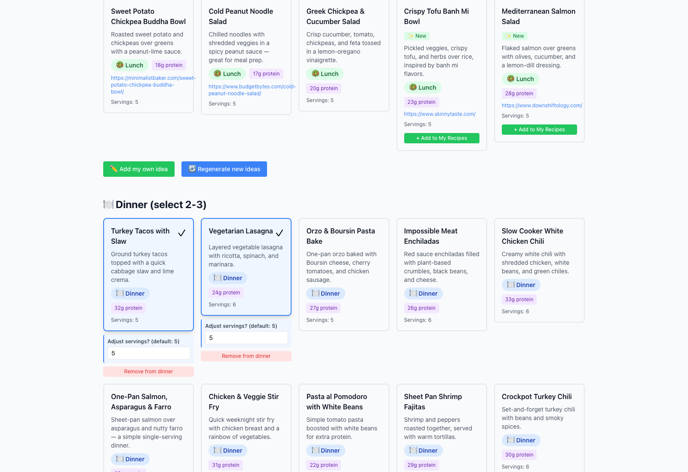
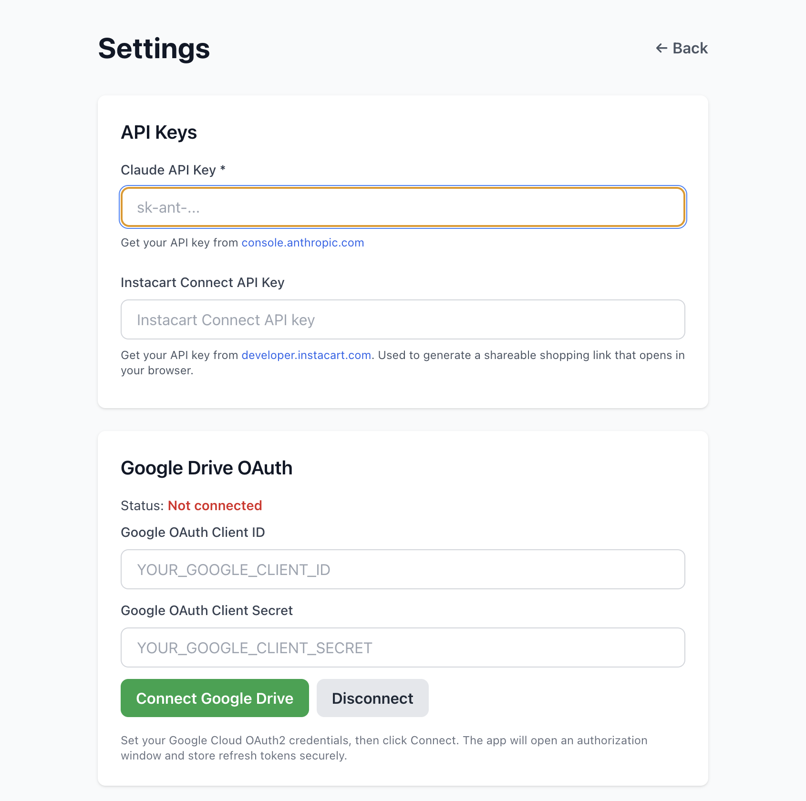

*Note: all screenshots below are from the real, running app. A couple of screens needed a Claude API key wired in to show live data, so for those I plugged in realistic sample meals matching my actual preferences instead of burning API calls — noted inline where that's the case.*

## The problem: a really good system that lived in the wrong place

For months, my weekly meal planning routine looked like this: open a Claude chat, paste in the same giant prompt I'd written once and saved in a doc, wait for it to spit out breakfast, lunch, and dinner ideas, then manually copy the winners into a spreadsheet and build a grocery list by hand.

It worked. That's the annoying part. The actual meal planning was solid — high protein, no red meat, a rotation of egg muffins and bowls for breakfast, big-batch salads for lunch, 2-3 dinners with leftovers. I'd tuned the prompt over time until it knew my staples, my preferred recipe blogs, even that I make Ninja Creami protein desserts. Here's a chunk of the actual prompt I was running every single week:

> Help me create a weekly meal plan + grocery list with a focus on high-protein, balanced meals for body recomposition (build muscle + lose fat). Give me 3 egg bite and 3 bowl breakfast options with one wild card breakfast idea; 8 lunch bowl / salad ideas; and 10 dinner ideas for set A and 10 new dinner ideas for set B.
>
> Core Preferences
> - I do not eat red meat
> - Prioritize high protein meals
> - Keep meals simple, prep-friendly, and realistic for a busy schedule

That's maybe a tenth of it. The full version had my exact daily structure, a list of staples to always check before shopping, links to specific recipes I liked, and rules about how new recipes should be sourced — some from my own spreadsheet, some freshly searched from sites like Minimalist Baker and Skinnytaste.

The system was good. The interface was the problem. Every week I was:

- Re-pasting the same giant prompt into a fresh chat
- Manually copying recipe names and ingredients into a Google Sheet
- Re-typing the grocery list into Instacart by hand
- Losing track of which recipes I'd already made that month, so I'd accidentally get the same suggestions again

None of that is Claude's fault — it did exactly what I asked. But a chat window isn't a place to *track state*. It doesn't remember that I made turkey tacos two weeks ago. It doesn't know which recipes are already in my spreadsheet versus brand new. It can't click a button to send a list to Instacart. I needed an actual app sitting on top of the same idea.

## Turning the prompt into a spec

Instead of trying to keep improving the chat prompt, I sat down and wrote out what I actually wanted as a real piece of software. I wrote a full spec doc — tech stack, data model, folder structure, the works — and at the top of it I literally wrote "Prepared for Claude Code," because that's who I was about to hand it to.

I also wrote out user stories in plain language, the kind of detail you'd give a contractor:

> - 10 Breakfast ideas generated
>   - 4 recipes should be variations of breakfast category subcategory Egg Muffins
>   - 4 recipes should be variations of breakfast category Scramble
>   - 2 recipes should be alternative breakfast recipes that are not from Egg Muffin or Scramble categories
>   - 2 out of the 10 recipes should be new recipes not currently on my MealPrep Recipes list
> - To be able to regenerate by section. i.e. if I click on one breakfast, I can re-generate the rest of the breakfast items only and the lunch and dinner recipes will be the same
> - To not have to re-authenticate with Google Drive every time if possible

Writing it this way — as specs and user stories instead of just "build me a meal planner" — turned out to matter a lot. It meant Claude Code wasn't guessing at what I wanted; it was implementing a checklist I'd already thought through. The spec settled the architecture questions up front (Electron for a real desktop app, React + TypeScript for the UI, Tailwind for styling, Zustand for state, my existing Recipes.xlsx on Google Drive as the source of truth instead of some new database I'd have to migrate into) so the actual build session could focus on building, not deciding.

## What got built

The result is **Meal Prep Planner**, a desktop app (Electron + React + TypeScript) that's basically my old chat prompt turned into a real interface with memory. Here's the empty state when you open it:

One button, "Generate My Week," replaces the whole copy-paste-the-prompt ritual. Click it and it pulls a mix of recipes from my actual spreadsheet plus freshly discovered ones, organized into the same categories I used to ask for by hand:

Notice the egg muffin variations, the protein counts on every card, the "New" badge on recipes that aren't in my spreadsheet yet — all of that maps directly back to the user stories I wrote. The "New" tag and the "+ Add to My Recipes" button exist because I specifically asked for a way to promote a freshly-discovered recipe into my permanent catalog without retyping it.

Scroll down and you get the full week — breakfast, lunch, and 20 dinner options (10 from my catalog, 10 brand new) instead of having to ask for "set A" and "set B" separately like I did in the chat version:

Clicking a recipe selects it for the week, and dinner — which needs 2-3 picks instead of just one — gets a servings adjuster and a "Remove from dinner" button per selection:

That servings field exists because of another detail from my user stories — I wanted to be able to bump a recipe from 5 servings to whatever I actually need that week without it changing the rest of the plan.

The settings screen is where API keys and the Google Drive connection live. This one's a real screenshot of the actual first-run experience — the app automatically drops you here if you haven't added a Claude API key yet, instead of letting you hit a broken "Generate" button:

## How I actually used Claude Code to build it

This wasn't a single "build me an app" prompt — it was closer to handing off a real project brief and then iterating. The spec doc and user stories did most of the heavy lifting up front: they meant I wasn't relitigating "should this be a web app or desktop app" mid-build, because I'd already decided (desktop, because I wanted it to feel like a permanent tool, not another browser tab I'd forget about).

From there it's been small, repeated rounds: build a piece, run it, see what's off, fix it. My git history is short and honest about that — three commits so far, the most recent literally titled "latest version with pre set counts and ability to regenerate," which was me asking for exactly the regenerate-by-category behavior from my user stories after the first pass didn't have it.

A few things I'd call out about working this way:

- **Writing the user stories first saved real back-and-forth.** Instead of describing the egg muffin rotation in conversation and hoping it landed right, I'd already written "4 should be egg muffins, 4 should be scrambles, 2 should be wildcards" — so the first version was already close.
- **The secure IPC bridge wasn't something I had to think about.** Electron apps need a careful boundary between the part that talks to your file system / APIs and the part that renders the UI (a `contextBridge` setup), and that's exactly the kind of plumbing I didn't want to hand-write. It just showed up correctly — `window.mealPrepAPI.meals.generate()`, `window.mealPrepAPI.recipe.save()`, and so on, all routed through a preload script instead of the UI reaching directly into Node or my API keys.
- **It's fine that it's not finished.** The Claude meal-generation call, the Instacart integration, and the full Google Drive OAuth flow are still placeholders or partial — and that's expected at this stage, not a failure. I built the spec assuming I'd get there in layers: UI first, then wire up each integration one at a time so I can test each piece on its own instead of debugging four new systems simultaneously.

## What's still placeholder, on purpose

In the interest of not overselling this: the app you see in these screenshots is real and running, but a few pieces underneath are stubbed out for now —

- Real Claude API calls for meal generation (currently returns structured placeholder data)
- The Instacart Connect integration for actually sending the grocery list
- The full Google Drive OAuth flow for syncing back to my live Recipes.xlsx

Those are next. The architecture for all three is already in the spec and partially built — the settings screen already has the OAuth connect button, the IPC bridge already has the right method names waiting to be filled in — it's just a matter of working through them one at a time the same way I worked through the planner UI.

## Why this was worth doing

I could have kept refining the chat prompt forever. It genuinely got pretty good. But the gap between "Claude gives great answers" and "this is part of my actual weekly routine" was the missing app layer — something with buttons, state, and memory of what I did last week. Writing the spec and user stories first, then handing that to Claude Code instead of building it myself from scratch, got me a working version of that app layer in three short iterations instead of a multi-weekend side project.

Next update will probably be once the real Claude meal-generation call is live — at that point "Generate My Week" goes from a placeholder button to the thing it's named for.
